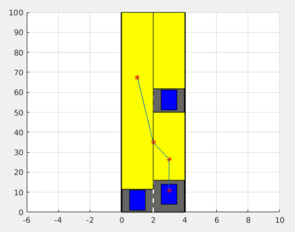
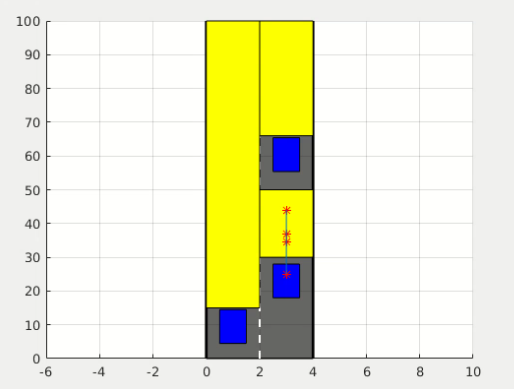
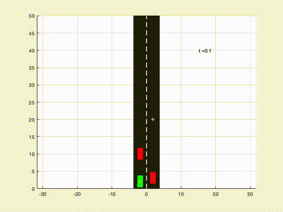

# Collision Free Space Planning For Autonomous Vehicles 

Collision Freespace is an evolving configuration space where no observable vehicle is present. 

Collision freespace can be tracked via a graph formed by discretization of observable road segment and tracking. 

A model of the freespace is shown below 

Another example: 

Planning over the collision freespace is done by curvature constrained Bezier curve. 

A sample is shown here: 

